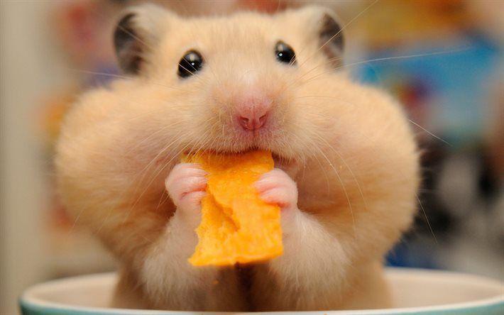
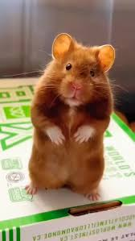

## Hi there, everyone! 👋

This is Libby's repo page for her Github account!

<!-- This is a Markdown comment!! It looks like an HTML comment (mostly-->

- 🔭 I’m currently working on understanding how to navigate GitHub
- 🌱 I’m currently learning what it means to be a computer science teacher in the day and age of AI
- 👯 I’m looking to collaborate on... oof... everything? Sustainability in teaching, integrating AI into CS classes while keeping kids accountable for learning the material, making AP CSA joyful? 

I teach at Northside College Prep. I am an alumnae of Indiana University Bloomington (undergrad), University of Chicago (PhD in bio), and UIC (masters in Ed). 

The first piece of tech I owned?! Well, that's a hard one. How do we define tech here? How do we define owning? Well, my first piece of tech was the Teddy Roxpin I coveted when I was six years old? Or maybe the Commodore 64 my brother and I cherished... until we got the Nintendo at any rate. The Commodore now sits in my closet waiting to be tinkered with. Teddy Roxpin and the Ninetendo were lost to the ages. 

My hometown is Lexington KY. 

My first academic love was biology. I even went so far as to get a PhD in Ecology and Evolution. I loved everything about it... except the actual career in research. That part was miserable! But I picked up a couple of programming languages along the way and, through a lot of twists, ended up teaching computer science to high school students - and I absolutely love it! Learning how to get students thinking critically about the technology they use every day is a passion for me! 

I should probably make this more serious, but for now while I am learning, my 10 year old and I agree that there's something about hamsters that is super funny!

May you be as happy with your day as a hamster with a cheezit, folks! 

 

<!--
**e-eakin/e-eakin** is a ✨ _special_ ✨ repository because its `README.md` (this file) appears on your GitHub profile.

Here are some ideas to get you started:

- 🔭 I’m currently working on ...
- 🌱 I’m currently learning ...
- 👯 I’m looking to collaborate on ...
- 🤔 I’m looking for help with ...
- 💬 Ask me about ...
- 📫 How to reach me: ...
- 😄 Pronouns: ...
- ⚡ Fun fact: ...
-->
